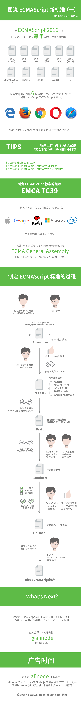

# ECMAScript 6简介
ECMAScript 和 JavaScript 的关系是，前者是后者的规格，后者是前者的一种实现

现建议阶段：https://github.com/tc39/proposals
浏览器支持率：kangax.github.io/compat-table/es6/
解决兼容性最好可以使用Babel，https://babeljs.io/

---
其他资料：
- [ECMAScript流程规范简介](https://erasermeng.github.io/2017/07/12/ECMAScript%E6%B5%81%E7%A8%8B%E8%A7%84%E8%8C%83%E7%AE%80%E4%BB%8B/)

待办（todo）：
- [x] ECMA从提出建议到成为最终标准发布，需要经历怎样的流程。
- [ ] 各个版本中加入了哪些特性
- [ ] babel如何使用

---
## 回答

### ECMA从提出建议到成为最终标准发布，需要经历怎样的流程。
看图片[ecmascript flow](./resource/ecmascript-flow.png)

