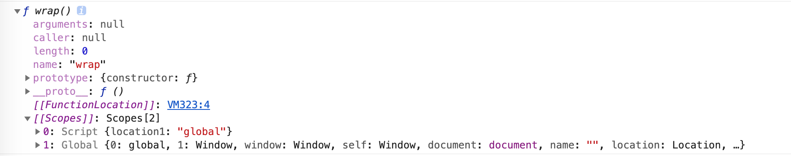

arguments原型链
- arg1
- arg2
- ...
- callee
- length
- Symbol()
    - `[[Scopes]]`
- `__proto__`: Object

```javascript
console.dir(wrap);// 1.1
debugger// 1.2
const location1 = 'global';// 2
var location1_1 = 'global1_1';// 2
function wrap() {// 1
    const location2 = 'wrap';// 3.1
    console.log(location1, location2, location1_1);// 3.2
}
wrap();// 3.3
```
我们来尝试还原一下上面代码的执行流程
**1、首先函数声明提升，会先声明wrap**
创建局部函数是，会创建一个预先包含全局变量的作用域链，这个作用域链保存在内部的`[[Scope]]`中。
我们可以通过`console.dir(wrap)`（1.1处）来看一下。

一个非常有意思的点，我们知道使用const声明的变量不会被添加到Global（window），所以这里的location1单独作为一个作用域链上的一员，而使用var声明的location1_1则包含在global作用域中。

那么如何理解“作用域链的本质是一个指向变量对象的指针列表，它只引用但不实际包含变量对象。”这句话呢？
`[[Scope]]`中记录的只是执行环境作用域的引用（或说指针），因为location1_1与location1是在函数声明之后声明的。~~个人感觉JS引擎会预先处理作用域链，所以在1.1打印的作用域链中包含这两个值。~~ 机智如我，在1.1代码后面加各debugger断点(1.2处)打印的wrap没有这两个值。因为chrome控制台的`console`是`Value below was evaluated just now.`。console打印的值并不严格是代码执行到那一刻的值。
但此时`location1: undefined`有是什么鬼？不是说const不会命名提升吗？
- [ ] 如何证明`[[Scope]]`保存的是指针
- [ ] 为什么const前作用域链上会有location1？

**2、声明变量location1_1与location1**
var存在变量声明提升，然后代码的执行顺序如下
```javascript
var location1_1;
const location1 = 'global';
location1_1 = 'global1_1';
```
**3、执行wrap**
**3.2、console.log(location1, location2, location1_1)执行**
调用局部函数时，会为函数创建一个执行环境，然后通过复制函数的`[[Scope]]`属性中的对象构建起执行环境的作用域链。然后当前函数的作用域被创建并推入指向环境作用域链的前端。此时作用域链：

0. wrap function: location2: 'wrap'
1. Script: { location1: 'global' }
2. Global: { location1_1: 'location1_1', ...}

每次取变量值，都会在当前执行环境中的作用域链中依次寻找变量，如果找到则返回。如果找不到（该值没有在作用域链的任意环境中声明过），则报错。
**3.3、函数执行完成**
因为该函数的作用域是局部的（相对于global全局作用域），所以在执行完成后作用域链销毁，作用域链上的各个变量可以通过JavaScript的垃圾回收机制进行自动销毁。

**总结**
如果再次执行wrap，则重复步骤3。
闭包的情况又会有差别，看下面的代码。

```javascript
console.dir(wrap);// 1.1
debugger// 1.2
const location1 = 'global';// 2
var location1_1 = 'global1_1';// 2
function wrap() {// 1
    const location2 = 'wrap';// 4.1
    return function() {// 4.2
        const location3 = 'inner';// 5.0
        console.log(location1, location2, location3);// 5.1
    }
}
const inner = wrap();// 4.0
inner();// 5.0
```
**4、wrap返回了一个函数**
执行wrap，该函数执行完成后，作用域链销毁。但此时返回了一个匿名函数。这个匿名函数被赋值给inner。inner的`[[Scope]]`包含了wrap的作用域，所以虽然wrap的作用域链销毁了，但是inner的作用域链还没销毁，wrap内的值就不会进入垃圾回收。

----

当某个函数被调用时，会创建一个执行环境（execution context）及相应的作用域链。然后使用arguments和其他命名参数的值来初始化函数的活动对象（activation object）。
但在外部作用域中，外部函数的活动对象始终处于第二位，外部函数的外部函数的活动对象处于第二位。。。一直到全局作用域。
后台的每个执行环境都有一个表示变量的对象--变量对象。全局环境的变量对象始终存在，局部环境变量只在函数执行过程中存在。
创建局部函数是，会创建一个预先包含全局变量的作用域链，这个作用域链保存在内部的`[[Scope]]`中。
调用局部函数时，会为函数创建一个执行环境，然后通过复制函数的`[[Scope]]`属性中的对象构建起执行环境的作用域链。然后当前函数的作用域被创建并推入指向环境作用域链的前端。作用域链的本质是一个指向变量对象的指针列表，它只引用但不实际包含变量对象。

一般情况下，局部对象执行完后会被立即销毁。但闭包的情况有所不同，因为活动对象的原型链上仍然应用局部对象，所以不会被销毁。创建对象的函数在执行完成后作用域链会被销毁。但创建对象在活动对象的作用域链上还存在。

```javascript
let funInner = null
function funWrap() {
    const wrap = 111;
    funInner = function () {
        console.log(wrap);
    }
}
funWrap();
funInner();
```
---


---
# function
闭包的作用
    模块模式、增强模块模式
        私有属性方法
        增强单例的公共接口
    构造函数模式
        解决构造函数每个实例都创建一组方法占用内存的缺点
    原型模式
